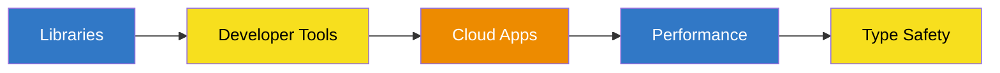
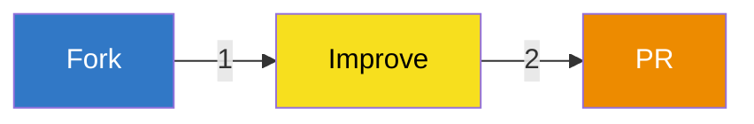

<div align="center">

# ABuilders 🏗️

### Building the future of developer tools, one line at a time.

[](https://twitter.com/sabdullahcxd)
[](https://github.com/abuilders)
[](https://choosealicense.com/licenses/mit/)

[Projects](#cool-stuff-weve-built-) • 
[Contributing](#want-to-help-) • 
[Community](#ground-rules-) • 
[Contact](#lets-chat-)

---

</div>

Hey there! 👋 Welcome to ABuilders

We're a group of passionate developers who love building cool stuff with JavaScript, TypeScript, and Java. While that might sound fancy, we're really just folks who enjoy creating software that makes other developers' lives easier.

<div align="center">

### 🎯 Our Focus Areas

</div>



## What we're all about 💡

We build all sorts of things, but mainly:
- 📚 Libraries that make your life as a developer way easier
- ⚡ Tools that boost your productivity (because who doesn't want that?)
- ☁️ Apps that actually work in the cloud without giving you headaches
- 🚀 Stuff that makes your code run faster (we're speed freaks!)
- 🛡️ TypeScript goodies that keep your code safe and sound

## Our favorite tools 🛠️

<div align="center">


</div>

And we use a bunch of other cool stuff like:
```text
🟢 Node.js (and its cooler cousin Deno)    🔵 Spring Boot (because Java can be fun too!)
🟣 React & Next.js (for those shiny UIs)   🔴 Jest & JUnit (gotta test 'em all)
🟡 Webpack & Rollup (bundling wizards)     🟤 Maven & Gradle (keeping Java organized)
```

## Cool stuff we've built 🚀

<table>
<tr>
<td width="33%">

### 💎 TypeScript Goodies
- **[Bandit Bot](https://github.com/abuilders/banditbot)** - Amazing Server Security bot that implements great features with great customization.

</td>
<td width="33%">

### 🌟 JavaScript Fun
`Coming soon!`

</td>
<td width="33%">

### ☕ Java Stuff
`Coming soon!`

</td>
</tr>
</table>

## How's everything doing? 📊

<div align="center">

| What we built | Status | How well tested | Version |
|:------------:|:--------:|:----------:|:---------:|
| [Bandit Bot](https://github.com/abuilders/banditbot) | [](https://github.com/abuilders/banditbot) | [](https://github.com/abuilders/banditbot) | [](https://github.com/abuilders/banditbot) |

</div>

## Want to help? 🤝

We'd love to have you on board! It's pretty simple:

<div align="center">



</div>

Check out our [Contributing Guidelines](CONTRIBUTING.md) for the full scoop.

## Ground Rules 📜

We want everyone to feel welcome here. Our [Code of Conduct](CODE_OF_CONDUCT.md) helps make that happen. Give it a quick read!

## Let's chat! 💬

<div align="center">

[](mailto:send@abdullahcxd.is-a.dev)
[](https://twitter.com/sabdullahcxd)

</div>

## The Legal Stuff 📄

Everything we do here is under the MIT License (unless we say otherwise). Feel free to use it, but be cool about it!

---

<div align="center">

### Made with ☕ and 💻 by the ABuilders crew


</div>
